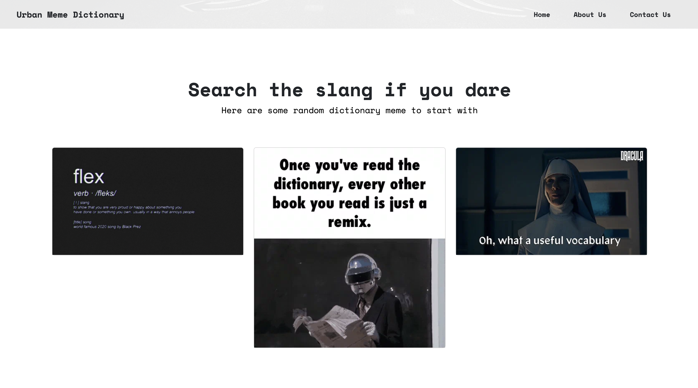
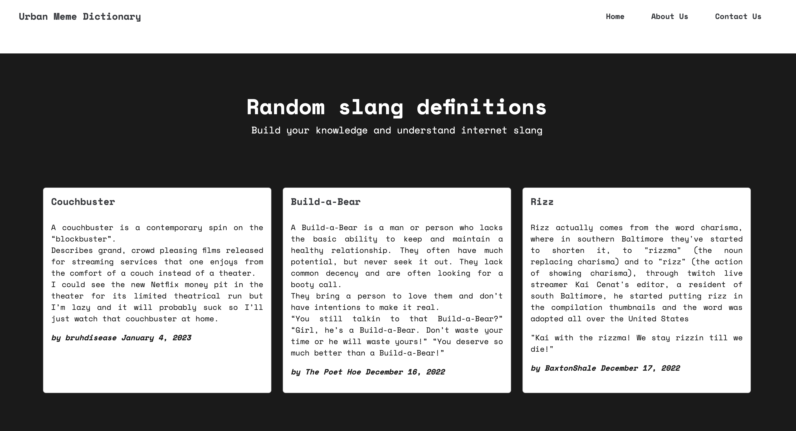
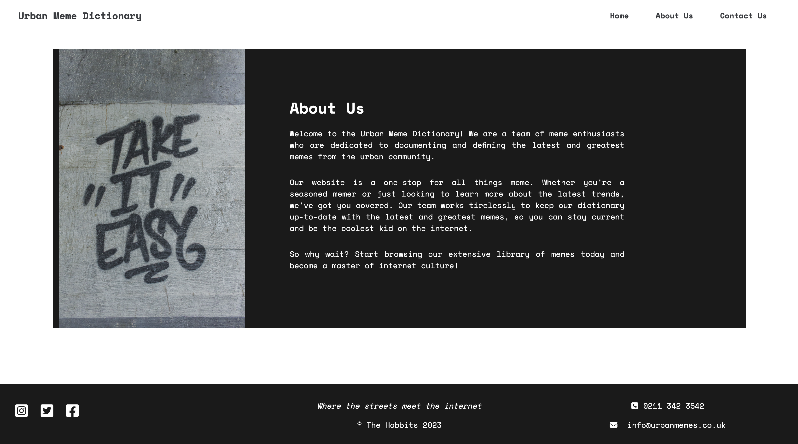
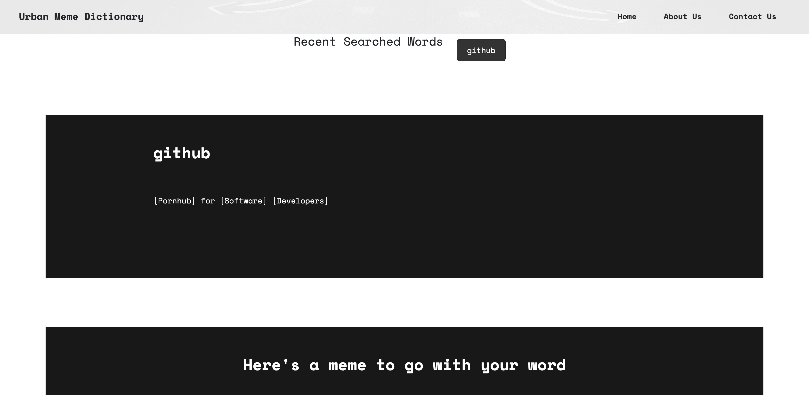
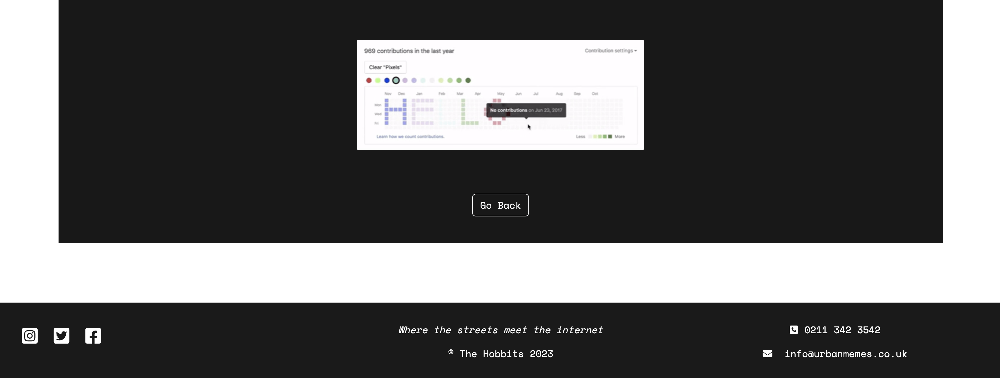

# Urban Meme Dictionary

## Description
Urban Meme Dictionary is a web application that allows users to browse through gifs and see their corresponding definition on Urban Dictionary. The application makes it easy for users to understand the meaning and context of the gifs and share them with their friends.

## Contents
* [Challenges](#challenges)
* [Things Learned](#things-learned)
* [Application Details](#appliocation-details)
* [Collaborators](#collaborators)

## Challenges
- Retrieving gifs and their corresponding definitions from Urban Dictionary API
- Displaying the gifs and their definitions in a user-friendly manner
- Implementing a search functionality for users to easily find specific gifs

## Things Learned
- How to use the Urban Dictionary API to retrieve gifs and - their corresponding definitions
- How to display gifs and their definitions in a user-friendly manner
- How to implement a search functionality for users to easily find specific gifs
- How to properly handle API errors and exceptions
- How to use CSS to style and improve the overall user experience of the application.

## Usage

User would be able to search for slang and trending GIFs, and see their corresponding definition so they can easily understand the meaning and context of the GIF and share it with their friends.

## Application details

Here is the live URL: https://cherryyeer.github.io/urban-meme-dictionary/

## Screenshot
- Home Page

- Search Result

# Contact
## Collaborators

Alina Tudor

- Github: [GitHub](https://github.com/alinatca)
- Email: alina_tca@yahoo.com
- Linkedin: [LinkedIn Profile](https://www.linkedin.com/in/alina-tudor-7a1047168/)

Samuel Oluyomi

- Github: [GitHub](https://github.com/hollusam)
- Email: oluyomisamuels@gmail.com
- Linkedin: [LinkedIn Profile](https://www.linkedin.com/in/oluyomi-samuel)

Yu Chen
- Github: [GitHub](https://github.com/cherryyeer)
- Email: yuchenwork57@gmail.com
- Linkedin: [LinkedIn Profile](https://www.linkedin.com/in/yu-c-a281341a0/)